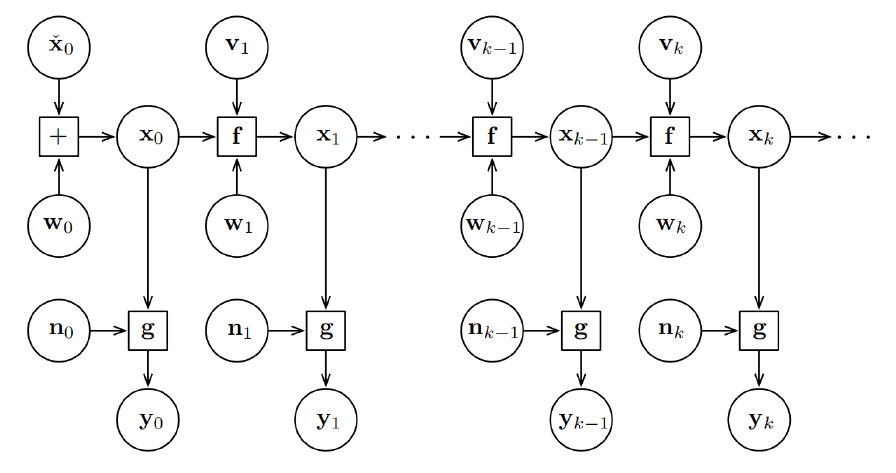
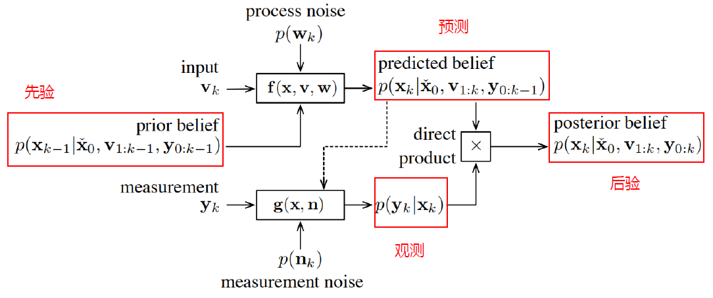
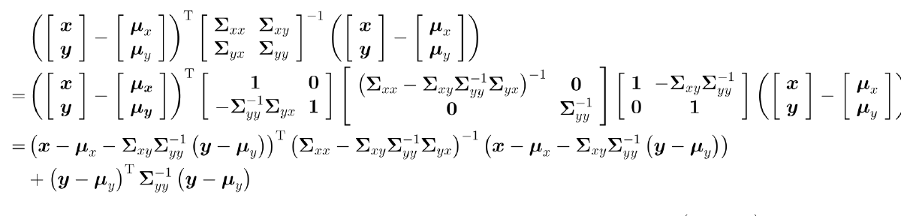
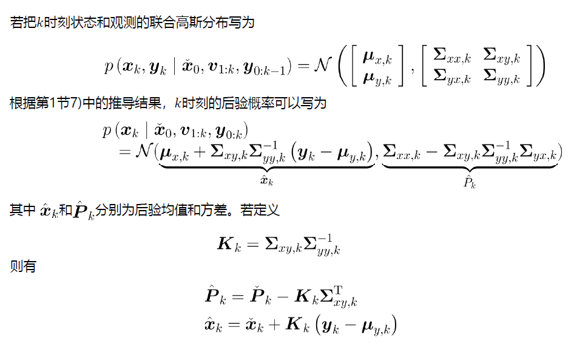
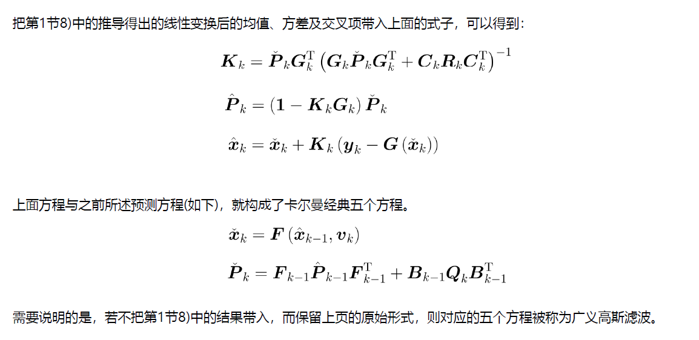

# 从贝叶斯到卡尔曼

## 1 状态估计模型

实际状态估计任务中，待估计的后验概率密度可以表示为：

$$
p(x_k|\check{x_0},v_{1:k},y_{0:k})
$$

其中$\check{x_0}$是状态初始值，$v_{1:k}$ 表示从1到k时刻的输入，$y_{0:k}$表示从0到k时刻的观测。用图模型描述历史数据之间的关系，可以表示为：

图模型体现了马尔可夫性，即当前状态只跟前一时刻状态有关，和其他历史时刻状态无关，所以对于SLAM问题，数学表达式如下：

运动方程：$x_k = f(x_{k-1},v_K,w_k)$ 

观测方程：$y_k = g(x_k,n_k)$ 

其中$x$ 为状态量，$v$ 为输入量，$w,n$为噪声。

##  2 贝叶斯滤波

### 2.1 贝叶斯公式：

联合概率分解成条件概率和边缘概率的乘积，即$p(x,y)=p(x|y)p(y)=p(y|x)(x)$ 整理得贝叶斯公式：

$$
p(x|y) = \frac{p(y|x)p(x)}{p(y)}
$$

对于后一项，因为y与x无关，可以认定p(y)为常数，所以可以写成如下形式：

$$
p(x|y) = \frac{p(y|x)p(x)}{p(y)} = \eta p(y|x)p(x)
$$

其中：

$$
\eta = \frac{1}{p(y)} = \frac{1}{\int p(y|x)p(x)dx}
$$

### 2.2 滤波求解过程：

将k时刻待估计的后验用如下符号表示：

$$
B(x_k)=p(x_k|\check{x_0},v_{1:k},y_{0:k})
$$

对$B(k)$ 利用贝叶斯公式进行展开：

$$
B(k)= p(x_k|\check{x_0},v_{1:k},y_{0:k})\\
\\
=\frac{p(y_k|x_k,\check{x_0},v_{1:k},y_{0:k-1})p(x_k|\check{x_0},v_{1:k},y_{0:k-1})}{p(y_k|\check{x_0},v_{1:k},y_{0:k-1})}\\
\\
=\eta p(y_k|x_k,\check{x_0},v_{1:k},y_{0:k-1})p(x_k|\check{x_0},v_{1:k},y_{0:k-1})
$$

根据观测方程，$y_k$ 只和$x_k$ 相关，因此上式可以写为：

$$
B(k) =\eta p(y_k|x_k)p(x_k|\check{x_0},v_{1:k},y_{0:k-1})
$$

 通过马尔可夫性分析，$x_k$仅与$x_{k-1}$有关，所以接下来引入$x_{k-1}$ 对B(k)后半段进行化简：
 
$$
\begin{aligned}
&p(x_k|\check{x_0},v_{1:k},y_{0:k-1}) \\ 
&=\int p(x_k,x_{k-1}|\check{x_0},v_{1:k},y_{0:k-1})dx_{k-1} \\
&= \int p(x_k|x_{k-1},\check{x_0},v_{1:k},y_{0:k-1})p(x_{k-1}|\check{x_0},v_{1:k},y_{0:k-1})dx_{k-1} \\
&= \int p(x_k|x_{k-1},v_k)p(x_{k-1}|\check{x_0},v_{1:k},y_{0:k-1})dx_{k-1}\\
&= \int p(x_k|x_{k-1},v_k)B(x_{k-1})dx_{k-1}
\end{aligned}
$$

在把这一项之前得一项乘上去，可得：

$$
B(k) = np(y_k|x_k)\int p(x_k|x_{k-1},v_k)B(x_{k-1})dx_{k-1}
$$

其中$B(k)$ 为估计量，$p(y_k|x_k)$为观测量(观测方程)，$p(x_k|x_{k-1},v_k)$为预测量(状态方程)，$B(x_{k-1})$为先验。所以贝叶斯滤波得信息流图如下：

## 3 卡尔曼滤波

### 3.1  高斯概率密度相关公式：

#### 多维高斯概率分布$x \sim N(\mu,\Sigma)$：

$$
p(x|\mu,\Sigma)=\frac{1}{\sqrt{(2\pi)^Ndet\Sigma}}exp(-\frac{1}{2}(x-\mu)^T\Sigma(x-\mu)) \tag{1}
$$

#### 联合高斯概率密度：

对于高斯分布：

$$
p(x) = N(\mu_x,\Sigma_{xx})\\
p(y) = N(\mu_y,\Sigma_{yy})
$$

则联合概率密度表示为：

$$
p(x,y) = N
\begin{pmatrix}
\begin{bmatrix}
\mu_x\\
\mu_y
\end{bmatrix},
\begin{bmatrix}
\Sigma_{xx}&\Sigma_{xy}\\
\Sigma_{yx}&\Sigma_{yy}
\end{bmatrix}
\end{pmatrix}
$$

利用舒尔补计算联合分布方差矩阵得逆矩阵：

$$
\begin{bmatrix}
\Sigma_{xx}&\Sigma_{xy}\\
\Sigma_{yx}&\Sigma_{yy}
\end{bmatrix} = \begin{bmatrix}
1&\Sigma_{xy}\Sigma_{yy}^{-1}\\
0&1
\end{bmatrix}
\begin{bmatrix}
\Sigma_{xx}-\Sigma_{xy}\Sigma_{yy}^{-1}\Sigma_{yx}&0\\
0&\Sigma_{yy}
\end{bmatrix}
\begin{bmatrix}
1&0\\
\Sigma_{yy}^{-1}\Sigma_{yx}&1
\end{bmatrix}
$$

$$
\begin{bmatrix}
\Sigma_{xx}&\Sigma_{xy}\\
\Sigma_{yx}&\Sigma_{yy}
\end{bmatrix}^{-1} = \begin{bmatrix}
1&0\\
-\Sigma_{yy}^{-1}\Sigma_{xy}&1
\end{bmatrix}
\begin{bmatrix}
(\Sigma_{xx}-\Sigma_{xy}\Sigma_{yy}^{-1}\Sigma_{yx})^{-1}&0\\
0&\Sigma_{yy}^{-1}
\end{bmatrix}
\begin{bmatrix}
1&-\Sigma_{xy}\Sigma_{yy}^{-1}\\
0&1
\end{bmatrix}
$$

所以对联合概率密度得指数部分二次项展开：

最后得到两个二次项的和，由于同底数幂相乘后，底数不变，指数相加，且$p(y)=N(\mu_y,\Sigma_{yy})$ 

所以:

$$
p(x|y) = N(\mu_x+\Sigma_{xy}\Sigma_{yy}^{-1}(y-u_y),\Sigma_{xx}-\Sigma_{xy}\Sigma_{yy}^{-1}\Sigma_{yx})
$$

#### 高斯随机变量得线性分布：

若$x,y$有如下关系：

$$
y = Gx+n\\
n=N(0,R)
$$

那么计算均值：

$$
\mu_y = E[y]\\
=E[Gx+n]\\
=G\mu_x
$$

方差：

$$
\Sigma_{yy} = \Sigma(Gx)+\Sigma(n)\\
 = E[(Gx-\mu_y)(Gx-\mu_y)^T]+R\\
=GE[(x-\mu_x)(x-\mu_x)^T]G^T+R\\
 =G\Sigma_{xx}G^T+R
$$

方差的交叉项：

$$
\Sigma_{xy} = E[(x-\mu_x)(y-\mu_y)^T]\\
=E[(x-\mu_x)(Gx-G\mu_x+n)^T]\\
=E[(x-\mu_x)(Gx-G\mu_x)^T+(x-\mu_X)n^T]\\
=\Sigma_{xx}G^T+E[(x-\mu_X)n^T]\\
=\Sigma_{xx}G^T
$$

同理：

$$
\Sigma_{yx} = \Sigma_{xy}^T = G\Sigma_{xx}
$$

### 3.2 卡尔曼滤波推导：

以矩阵形式重写运动观方程：

运动方程：$x_k=F(x_{k-1},v_K)+B_{k-1}w_k$

观测方程：$y_k=G(x_k)+C_kn_k$

上一时刻的后验$B(k)= p(x_{k-1}|\check{x_0},v_{1:k-1},y_{0:k-1})=N(\hat{x_{k-1}},\hat{P_{k-1}})$

当前时刻的预测：$\check{x_k}=F(\hat{x_{k-1},v_K})$

根据高斯分布线性变化，方差为：

$$
\check{P_k}=F_{k-1}\hat{P_{K-1}}F_{k-1}^T+B_{k-1}Q_kB_{k-1}^T
$$

其中$Q_k$为输入方差。

